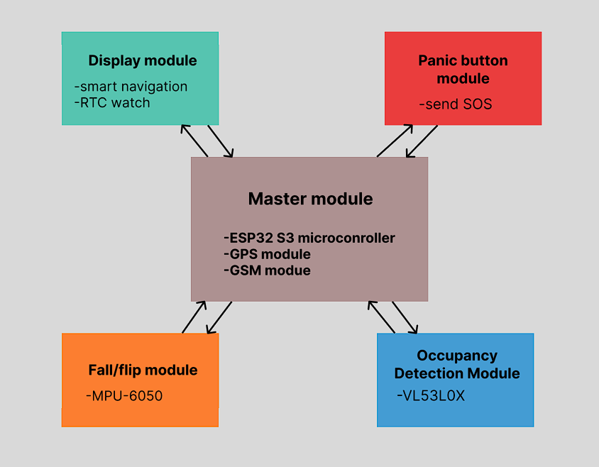

# WheelMate
> Modular smart wheelchair platform improving mobility, safety and independence for wheelchair users via real-time GPS tracking and SOS emergency alerts.

---

## Table of Contents
- [Introduction](#-introduction)
- [Features](#-features)
- [API Documentation](#-api-documentation)
- [Hardware Schematics](#-schematic)
- [Tech Stack](#-tech-stack)
- [Installation Guide](#-installation-guide)
- [Usage](#-usage)
- [Future Improvements](#-future-improvements)
- [License](#-license)

---

## Introduction

**The problem:**
- In emergency situations, users often cannot call for help quickly or reliably.
- Wheelchair users lack smart tools for real-time navigation adapted to their mobility needs.
- Caregivers and family members have no way to remotely monitor the user's location or safety.

**Our solution:**

WheelMate is a modular IoT platform for smart wheelchairs. It combines an ESP32-based hardware module with a Spring Boot backend and a mobile app to deliver real-time GPS/GSM tracking, obstacle detection via ultrasonic sensors, a one-press SOS panic button, and a user-friendly on-device display. Emergency signals are automatically dispatched to registered contacts and volunteer organizations.

---

## Features

### Core Features
- Real-time tracking of the wheelchair's location
- SOS panic button — instantly alerts registered contacts and volunteer organizations
- Smart mobility-aware navigation (avoids stairs, curbs, inaccessible routes)
- Fall/tip detection with accelerometer sensor
- On-device display (OLED) showing navigation info and real time

### Extra Features
- User authentication
- Volunteer organizations system

---

## API Documentation

Base URL: `http://localhost:7070/api`

### Wheelchair

| Method | Endpoint | Description |
|--------|----------|-------------|
| `POST`   | `/wheelchair/addwheelchair` | Add a wheelchair with GPS coordinates and speed. |
| `GET`    | `/wheelchair/getallwheelchair` | Get all wheelchairs from DB. |
| `GET`    | `/wheelchair/getwheelchair/{id}` | Get a single wheelchair by ID. |
| `PATCH`  | `/wheelchair/updatewheelchair/{id}` | Update wheelchair parameters. |
| `DELETE` | `/wheelchair/deletewheelchair/{id}` | Delete a wheelchair by ID. |

---

### Caretaker

| Method | Endpoint | Description |
|--------|----------|-------------|
| `POST`   | `/caretaker/add` | Add a new caretaker with name and number. |
| `GET`    | `/caretaker/get/{id}` | Get a single caretaker by ID. |
| `GET`    | `/caretaker/getall` | Get all caretakers. |
| `PATCH`  | `/caretaker/update/{id}` | Update a caretaker's name or number. |
| `DELETE` | `/caretaker/delete/{id}` | Delete a caretaker by ID. |

---

### Reletionships

| Method | Endpoint | Description |
|--------|----------|-------------|
| `POST`   | `/caretaker/add` | Connect caretaker with user. |
| `POST`   | `/relative/add` | Connect relative with user. |
| `GET`    | `/caretakers` | Get all caretaker. |
| `GET`    | `/relatives` | Get all relatives. |

---

### Authentication

| Method | Endpoint | Description |
|--------|----------|-------------|
| `POST` | `/auth/register?role=CARETAKER` | Register user with email, username and password. |
| `POST` | `/auth/verify` | Verify user with a code sent to their email. |
| `POST` | `/auth/login` | Login a verified user with email and password. |
| `GET`  | `/auth/me` | Get the currently authenticated user. |
| `GET`  | `/auth/getallusers` | Get all authenticated users from DB. |

---

### Admin

| Method | Endpoint | Description |
|--------|----------|-------------|
| `PATCH` | `/admin/users/role` | Update user's role . |

---

### User Profile

| Method | Endpoint | Description |
|--------|----------|-------------|
| `POST`   | `/userprofile/createuserprofile` | Create a user profile with address, photo and telephone. |
| `GET`    | `/userprofile/getuserprofile/{id}` | Get a user profile by ID. |
| `PATCH`  | `/userprofile/updateuserprofile/{id}` | Update a user profile by ID. |
| `DELETE` | `/userprofile/deleteuserprofile/{id}` | Delete a user profile by ID. |

---
## Schematic

---

## Tech Stack

| Layer | Technology |
|-------|-----------|
| **Firmware** | C++ (Arduino framework), ESP32 S3 |
| **Sensors** | NEO-6M GPS, SIM800L GSM, MPU6050 |
| **Display** | SSD1306 OLED display |
| **Backend** | Spring Boot |
| **Database** | PostgreSQL |
| **Authentication** | JWT |
| **Frontend** | React Native (Expo) |
| **Build tools** | Maven, PlatformIO |

---

## Installation Guide

### Prerequisites
- Java 25+
- Maven 3.9+
- PostgreSQL
- PlatformIO
- Node.js 24+ (for mobile app)

---

## Future Improvements

---

## License

This project is licensed under the MIT License — see the [LICENSE](LICENSE) file for details.
